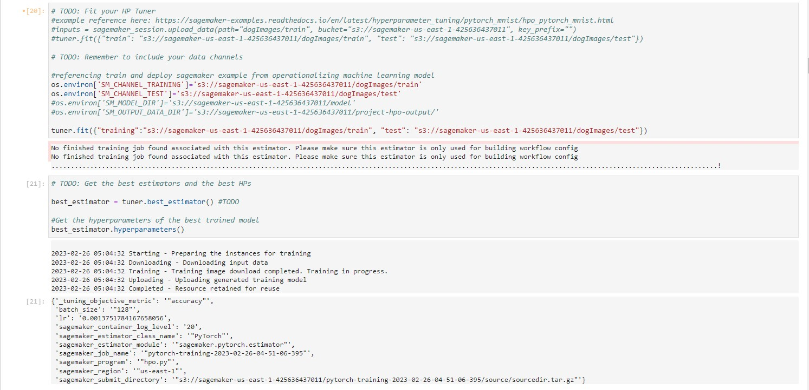
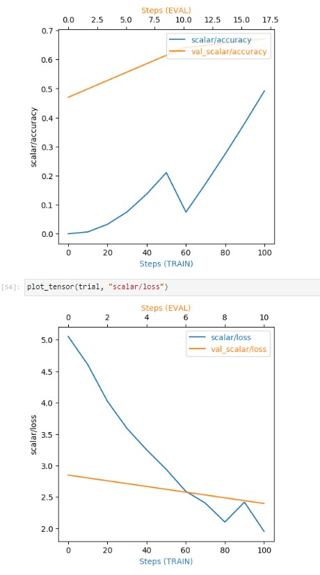
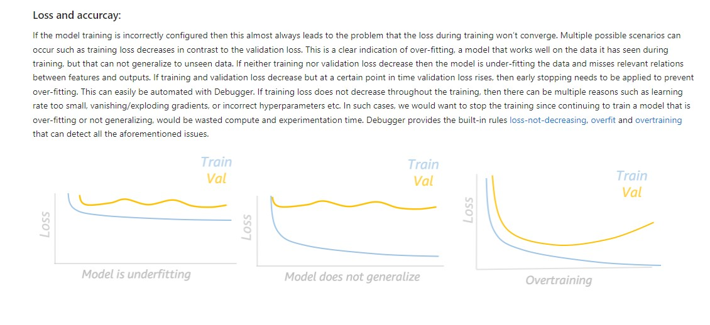
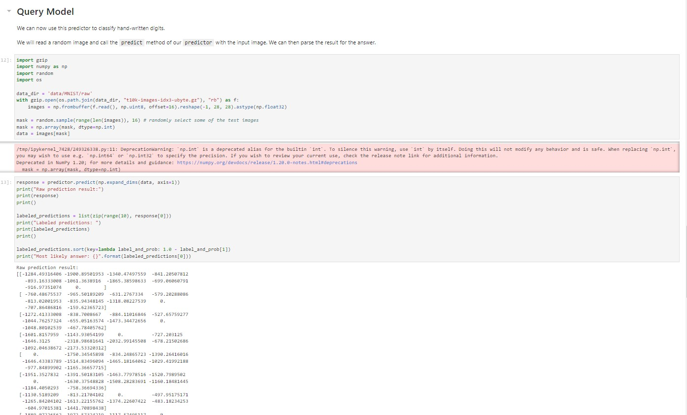
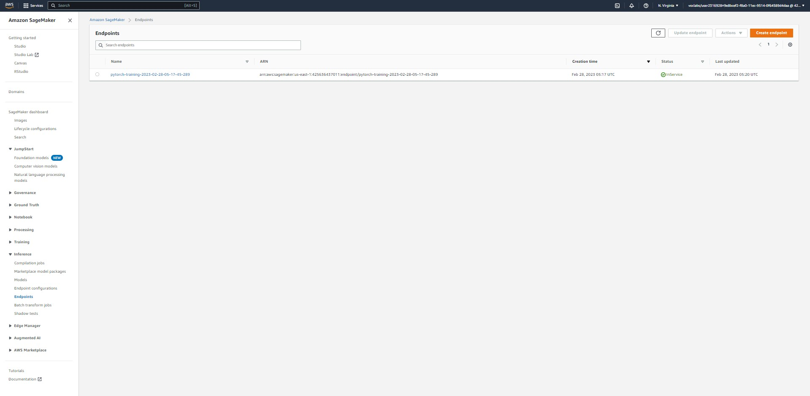
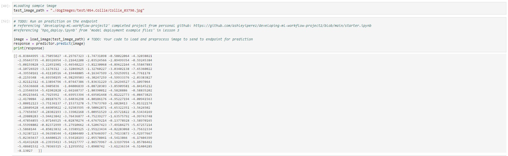

# Report: Image Classification using AWS Sagemaker
#### Ashley Perez
###Date: 02/27/2023

#Introduction: This project is an introductory-level image classification model using a pre-trained Resnet deep learning model and pre-labeled images for 133 different dog breeds.

#Project Set-Up Instructions: Please run notebook in chronological order and include all provided files in same directory. Please find all materials and sources referenced throughout the notebook and script files for more information on way code was written.

##The Files in this Project:
###hpo.py: This file is written in to train the model on chosen hyperparameters from a specified range. This allowed me to extract the best hyperparameters from these ranges to tune my model.
###train_model.py: This file is written to train my model on the best hyperparameters from the tuning stage of this project.
###inference.py: This file is written to translate the input and output of a single image to a model endpoint to be able to receive prediction response.
###train_and_deploy.ipynb:This is the Jupyter Notebook file from AWS Sagemaker that contains the configurations, debugging, notes, and estimators I used to train and deploy my model.

## Step 1: Dataset
### Explain what dataset you are using for this project. Maybe even give a small overview of the classes, class distributions etc that can help anyone not familiar with the dataset get a better understand of it.
I am using a pre-built dataset for 133 different dog breeds. Each breed has it's own folder nested inside the dataset folder. Each dog breed folder has a handful (5-7 images) of each dog breed with varying general features and backgrounds.

### What was the most challenging part about uploading the dataset to AWS S3 bucket?
There wasn't a straight forward way to upload the dataset from the notebook without using S3Uploader from sagemaker.s3. This was a useful package that allowed me to upload my images to my default s3 bucket.

## Step 2: Hyperparameter Tuning
### Explain why you chose to tune those particular hyperparameters and the ranges in your project?
The two hyperparameters I chose to tune were learning rate and batch size. The learning rate tuning involving a continuous scale, while batch size involved a categorical scale. These hyperparameters were chosen as epochs were held constant for cost and times savings. Further, the best hyperparamters were unknown for these specific ones tested, so the goal of the tuning was to find the best parameters to use in the final model. 

### What were the best hyperparameters from tuning? 
Using accuracy as the metric to measure the best hyperparameters, the best batch size was 128 and the best learning rate was 0.003.

### Here are at least 2 different training runs and their results:

## Step 3: Model Profiling and Debugging
### What were some major differences between your hyperparameter tuning job and PyTorch training job? 
1. The hyperparameter tuning job used the 'HyperparameterTuner' function while using 'Pytorch' function for the estimator training job and they had slightly different configurations.
2. The entry files were different as well, the tuning job code helped start the training job, but the functions required from training were slightly more involved.
3. The output per job was different, hyperparameter tuning did not take as long as training and training outputted results as code ran while hyperparameter outputs were extracted once job was completed.

### Here is the plot chart of the model debugger output:

###  Is there some anomalous behaviour in your debugging output? If so, what is the error and how will you fix it?
The output for loss and accuracy for both models seemed appropiate; accuracy increased as steps progressed and loss decreased. If there was a noticable error in the output, I would likely spend time debugging, and did spend some time testing, the hook parameters and configuration. Decreasing the step size and viewing the output with this change would help bring granularity to training job progress. Further, for loss, I have a link in my helpful links document for this project that talks about model underfitting, not generalizing, or overtraining and so depending on what the plot looked like, I would trouble shoot the model training or data loaders in the case that one of these issues arose.  

### Here are some notes on what to look for in loss charts for adjusting model training:

## Step 4: Testing and Evaluation
### What was the outcome of for deploying and querying the pre-trained model as an endpoint? 
The trained model successfully deployed. I selected a test image from the dataset to transform, load, and query. The output was a matrix of probabilities of the classes it could be.

### Here an example of query code for a multi-classification model:

### Here is an image of the deployed endpoint code working:

### Here is the output for querying the endpoint of the model:

### What are some insights you gained from this model? 
This multi-classification pre-trained model allowed me to gain some insights into the types of configurations required and predicting behaviors that are affected by hyperparameters, really introducing me to considerations to be made in the process of training a pre-trained multi-classification model. This was especially supplemented by the connect sessions, looking at defining the simpler terms, such as steps, epochs, learning rate, was really effective in bettering my understanding of what the configurations meant and get some sort of intuition for what ranges are acceptable starting points. Further, the profiling and debugging tools gave me some trouble, but this resulted in extensive reading into the documentation and introduced the concept of model monitoring and this may prove useful when improving a model. As part of this course, I am also learning how to filter documentation, create catalogs for myself, and even use ChatGPT to help me find anwers and examples that I can reference for future work! The model prediction output was as expected from the example I found for the query, and it seems that multi-classification model outputs may be more difficult to interpret to someone who does not know the model and configuration of the data, so I suspect that the output would be best filtered and explained through format for real world applications.

## Summary
Gaining hands-on experience with and experimenting with training a pre-trained neural network allowed more understanding of what configuration must be considered when deep neural network types of models are deployed. Further, cost saving techniques were used throughout this project to prevent from losing access to information and exceeding budget, which included excluding validation part of dataset to reduce to a subset of the dataset, attaching models to an estimator instead of re-running a model training estimator for deployment, and using free tools to troubleshoot re-occuring issues gave more ideas and sense for where costs may be saved throughout a machine learning job in sagemaker. This allowed me to attempt to run over a hundred training jobs to further debug and test my code. The tools introduced in these lessons are valuable for monitoring and benchmarking model training for deployment. A catalog of links may be helpful for further debugging or future projects.